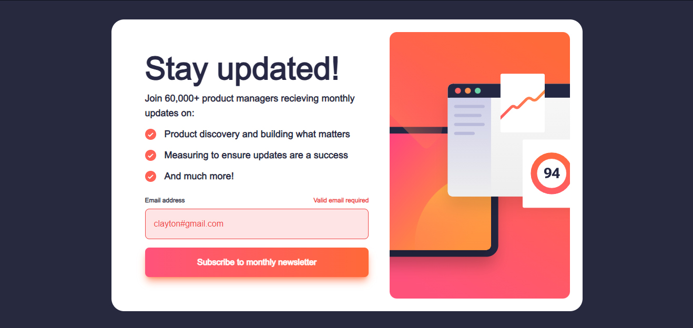
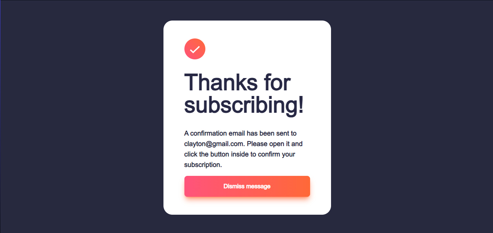

# Frontend Mentor - Newsletter sign-up form with success message solution

This is a solution to the [Newsletter sign-up form with success message challenge on Frontend Mentor](https://www.frontendmentor.io/challenges/newsletter-signup-form-with-success-message-3FC1AZbNrv). Frontend Mentor challenges help you improve your coding skills by building realistic projects. 

## Table of contents

- [Overview](#overview)
  - [The challenge](#the-challenge)
  - [Screenshot](#screenshot)
  - [Links](#links)
- [My process](#my-process)
  - [Built with](#built-with)
- [Author](#author)

## Overview

### The challenge

Users should be able to:

- Add their email and submit the form
- See a success message with their email after successfully submitting the form
- See form validation messages if:
  - The field is left empty
  - The email address is not formatted correctly
- View the optimal layout for the interface depending on their device's screen size
- See hover and focus states for all interactive elements on the page

### Screenshot

### Links

- Solution URL: [https://github.com/wait4ndbleed/newsletter-sign-up-with-success-message-main/](https://github.com/wait4ndbleed/newsletter-sign-up-with-success-message-main/)
- Live Site URL: [https://wondrous-travesseiro-2b868c.netlify.app](https://wondrous-travesseiro-2b868c.netlify.app)

## My process

### Built with

- Semantic HTML5 markup
- CSS custom properties
- Flexbox
- Mobile-first workflow
- [React](https://reactjs.org/) - JS library
- [Next.js](https://nextjs.org/) - React framework
- [Tailwind](https://tailwindcss.com/) - For CSS
- [React Hook Form](https://react-hook-form.com/) - Form Validation

## Author

- Website - [Clayton Ferreira](https://github.com/wait4ndbleed)
- Frontend Mentor - [@wait4ndbleed](https://www.frontendmentor.io/profile/wait4ndbleed) 
